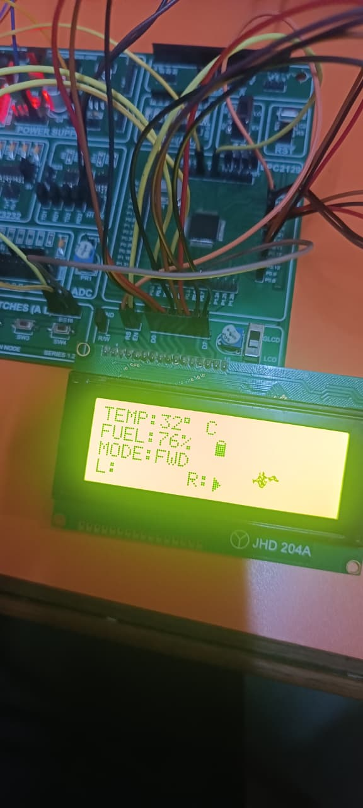
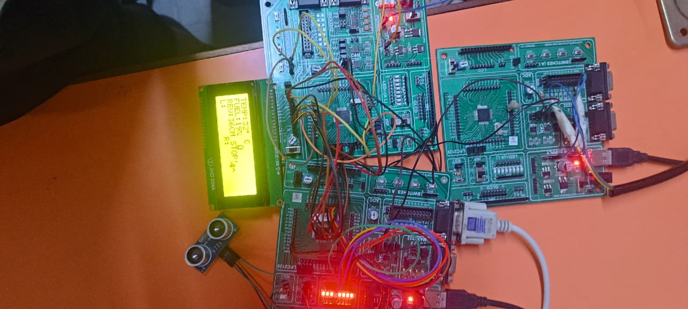

# 🚗 CAN-Driven Vehicle Monitoring and Driver Assistance System

<p align="center">
  <b>Three-Node CAN-Based Automotive Embedded System</b>
</p>

<p align="center">
  🧠 LPC2129 ARM7 &nbsp; | &nbsp;
  💻 Embedded C &nbsp; | &nbsp;
  📡 CAN &nbsp; | &nbsp;
  🚘 Automotive Embedded Systems
</p>

---

# 📖 Overview

The **CAN-Driven Vehicle Monitoring and Driver Assistance System** is a three-node embedded system developed using the **LPC2129 ARM7 microcontroller** and **Controller Area Network (CAN)** protocol.

The system monitors important vehicle parameters and provides driver-assistance functions through distributed CAN nodes.

### 🔹 System Functions

- 🌡️ Engine temperature monitoring
- ⛽ Fuel-level monitoring
- 🚦 Left and right indicator control
- 📏 Reverse obstacle detection
- 🔊 Reverse warning using buzzer
- 🖥️ Centralized LCD dashboard
- 📡 CAN-based communication between multiple nodes

### 🔹 System Nodes

| Node | Function |
|---|---|
| 🖥️ **Main Node** | Central controller, LCD, temperature monitoring and switch handling |
| 🚦 **Indicator & Reverse Alert Node** | Indicator control and reverse obstacle detection |
| ⛽ **Fuel Node** | Fuel measurement and CAN transmission |

The three nodes communicate through a **CAN bus using MCP2551 CAN transceivers**.

---

# 🎯 Project Objective

To design and implement a **three-node CAN-based vehicle monitoring and driver assistance system** capable of:

- ⛽ Monitoring fuel level
- 🌡️ Monitoring engine temperature
- 📏 Detecting obstacles during reverse operation
- 🚦 Controlling left and right indicators
- 🔊 Providing SAFE, WARNING and STOP reverse-alert status
- 🖥️ Displaying real-time vehicle information on a centralized LCD

---

# ✨ Key Features

- 🔗 Three-node CAN communication
- 🧠 LPC2129 ARM7-based embedded system
- 🌡️ DS18B20 engine temperature monitoring
- ⛽ Fuel percentage measurement using on-chip ADC
- 📡 CAN-based fuel information transmission
- 🔄 Forward / Reverse mode selection
- 🚦 Left / Right indicator control
- 📏 HC-SR05 ultrasonic obstacle detection
- 🔊 Buzzer-based reverse warning
- ⚠️ SAFE / WARNING / STOP status
- 🖥️ Centralized LCD dashboard
- ⚡ External interrupt-based switch handling

---

# 🏗️ System Architecture

## 1️⃣ 🖥️ Main Node

The **Main Node** acts as the central controller of the complete system.

### Responsibilities

- 🌡️ Reads engine temperature from the **DS18B20**
- 🖥️ Displays engine temperature on LCD
- ⛽ Receives fuel percentage from Fuel Node through CAN
- 📊 Displays fuel percentage
- ⚡ Monitors Mode Selection Switch using external interrupt
- 🔄 Selects Forward or Reverse Mode

### 🚘 Forward Mode

When Forward Mode is selected:

- ⬅️ Monitors Left Indicator Switch (SW1)
- ➡️ Monitors Right Indicator Switch (SW2)
- 📡 Sends Left Indicator command through CAN
- 📡 Sends Right Indicator command through CAN

### 🔙 Reverse Mode

When Reverse Mode is selected:

- 📡 Receives Reverse Alert Status through CAN
- 🖥️ Displays:

🟢 **SAFE**

🟡 **WARNING**

🔴 **STOP**

---

# 2️⃣ 🚦 Indicator & Reverse Alert Node

This node performs two major functions:

- 🚦 Vehicle indicator control
- 📏 Reverse obstacle detection

## 🚘 Forward Mode

When Forward Mode is received:

- Reverse obstacle detection is disabled
- ⬅️ Left command → Left LEDs blink
- ➡️ Right command → Right LEDs blink
- ⏹️ OFF command → All LEDs OFF

## 🔙 Reverse Mode

When Reverse Mode is received:

1. Normal indicator operation is disabled.
2. HC-SR05 ultrasonic sensor is enabled.
3. Obstacle distance is continuously measured.
4. Distance is compared with predefined ranges.

### ⚠️ Reverse Alert Logic

| 🚧 Condition | 🔊 Buzzer | 💡 LED | 📡 CAN Status |
|---|---|---|---|
| 🟢 Safe | OFF | OFF | **SAFE** |
| 🟡 Warning | Intermittent | — | **WARNING** |
| 🔴 Critical | Continuous | Reverse Alert LED ON | **STOP** |

The corresponding status is transmitted to the **Main Node through CAN**.

---

# 3️⃣ ⛽ Fuel Node

The **Fuel Node** monitors the fuel level.

### 🔄 Working

```text
Fuel Gauge
     ↓
Analog Input
     ↓
LPC2129 ADC
     ↓
ADC Value
     ↓
Fuel Percentage
     ↓
CAN Transmission
     ↓
Main Node
```

The Fuel Percentage is periodically transmitted to the Main Node.

When there is a significant change in fuel percentage, the updated value is transmitted immediately.

---

# 📡 CAN Communication

## 🖥️ Main Node → 🚦 Indicator & Reverse Alert Node

The Main Node sends:

- 🔄 Vehicle Mode
- ⬅️ Left Indicator command
- ➡️ Right Indicator command
- ⏹️ Indicator OFF command

## 🚦 Indicator & Reverse Alert Node → 🖥️ Main Node

The node sends:

- 🟢 SAFE
- 🟡 WARNING
- 🔴 STOP

## ⛽ Fuel Node → 🖥️ Main Node

The Fuel Node sends:

- ⛽ Fuel Percentage

---

# 🔄 CAN Communication Flow

```text
                    📡 CAN BUS
                        │
                        │
              ┌─────────▼─────────┐
              │   🖥️ MAIN NODE    │
              │      LPC2129      │
              │                   │
              │  LCD + DS18B20    │
              │  Switches         │
              └─────────┬─────────┘
                        │
              ┌─────────┴─────────┐
              │                   │
              ▼                   ▼
 ┌──────────────────────┐   ┌──────────────────┐
 │ 🚦 INDICATOR &       │   │ ⛽ FUEL NODE     │
 │ REVERSE ALERT NODE   │   │                  │
 │                      │   │ LPC2129 + ADC    │
 │ LPC2129 + MCP2551    │   │ Fuel Gauge       │
 │ LEDs + HC-SR05       │   │                  │
 │ Buzzer               │   │                  │
 └──────────────────────┘   └──────────────────┘
```

---

# 🧩 Hardware Requirements

| 🔧 Hardware | Purpose |
|---|---|
| 🧠 LPC2129 ARM7 | Microcontroller |
| 📡 MCP2551 | CAN Transceiver |
| 💡 LEDs | Indicator / alert |
| 🖥️ LCD | Dashboard display |
| 📏 HC-SR05 | Obstacle detection |
| ⛽ Fuel Gauge | Fuel measurement |
| 🔘 Switches | Mode / indicator control |
| 🔌 USB-to-UART | Serial communication |
| 🌡️ DS18B20 | Temperature sensing |
| 🔊 Buzzer | Reverse alert |

---

# 💻 Software Requirements

- 💻 Embedded C Programming
- 🛠️ Keil-C Compiler
- ⚡ Flash Magic

---

# 🔧 Technologies Used

- 💻 Embedded C
- 🧠 LPC2129 ARM7
- 📡 CAN Protocol
- 📡 MCP2551
- 🔌 GPIO
- 📈 ADC
- ⚡ External Interrupts
- 🖥️ LCD Interfacing
- 🌡️ DS18B20
- 📏 HC-SR05
- ⛽ Fuel Gauge
- 🔌 UART
- 🔗 ECU Communication

---

# 🔄 Implementation Sequence

## 1️⃣ Project Setup

Create separate folders for:

- 🖥️ Main Node
- 🚦 Indicator & Reverse Alert Node
- ⛽ Fuel Node

## 2️⃣ LCD Testing

Verify:

- Character display
- String display
- Integer display

## 3️⃣ ADC Testing

- Connect variable voltage using potentiometer
- Read ADC value
- Display ADC value on LCD

## 4️⃣ Fuel Percentage

- Develop fuel percentage calculation
- Display fuel percentage on LCD

## 5️⃣ External Interrupt Testing

- Test external interrupts
- Count interrupt occurrences
- Display interrupt count

## 6️⃣ HC-SR05 Testing

- Generate trigger pulse
- Measure echo duration
- Calculate obstacle distance
- Display distance on LCD

## 7️⃣ Temperature Sensor Testing

- Interface DS18B20
- Read engine temperature
- Display temperature on LCD

## 8️⃣ CAN Testing

- Test CAN hardware
- Verify CAN transmission
- Verify CAN reception
- Analyze CAN communication

## 9️⃣ Node Development

Develop:

- 🖥️ Main Node
- 🚦 Indicator & Reverse Alert Node
- ⛽ Fuel Node

## 🔟 System Integration

Connect all three nodes through the CAN bus and test the complete system.

---

# 📊 System Flow

```text
                         📡 CAN BUS
                             │
          ┌──────────────────┼──────────────────┐
          │                  │                  │
          ▼                  ▼                  ▼
   ┌──────────────┐  ┌──────────────────┐  ┌──────────────┐
   │ 🖥️ MAIN NODE │  │ 🚦 INDICATOR &   │  │ ⛽ FUEL NODE │
   │              │  │ REVERSE ALERT    │  │              │
   │ LPC2129      │  │ NODE             │  │ LPC2129      │
   │              │  │ LPC2129          │  │ + ADC        │
   └──────┬───────┘  └────────┬─────────┘  └──────┬───────┘
          │                   │                   │
     ┌────┴─────┐       ┌─────┴──────┐       ┌────┴──────┐
     │ 🖥️ LCD   │       │ 💡 LEDs    │       │ ⛽ Fuel    │
     │ 🌡️ DS18B20│      │ 📏 HC-SR05 │       │ 📈 ADC     │
     │ 🔘 Switch│       │ 🔊 Buzzer  │       │            │
     └──────────┘       └────────────┘       └────────────┘
```

---

# 🖥️ Centralized Dashboard

The Main Node LCD displays:

```text
╔══════════════════════════════════╗
║     🚗 VEHICLE MONITORING        ║
╠══════════════════════════════════╣
║ 🌡️ Engine Temp : XX °C           ║
║ ⛽ Fuel Level  : XX %             ║
║ 🚘 Mode        : FORWARD/REVERSE ║
║ ⚠️ Alert       : SAFE/WARNING/STOP║
╚══════════════════════════════════╝
```

---

# 🖼️ Actual Hardware Block Diagram

<p align="center">
  
</p>

<p align="center">
  <b>Three-Node CAN-Based Vehicle Monitoring and Driver Assistance System</b>
</p>

---

# 📂 Project Folder Structure

```text
CAN-Driven-Vehicle-Monitoring-and-Driver-Assistance-System/
│
├── 📁 Main_Node/
│   ├── 📄 main.c
│   ├── 📄 can.c
│   ├── 📄 lcd.c
│   ├── 📄 ds18b20.c
│   └── 📄 ext_interrupt.c
│
├── 📁 Indicator_Reverse_Alert_Node/
│   ├── 📄 main.c
│   ├── 📄 can.c
│   ├── 📄 hc_sr05.c
│   ├── 📄 buzzer.c
│   └── 📄 indicator.c
│
├── 📁 Fuel_Node/
│   ├── 📄 main.c
│   ├── 📄 can.c
│   └── 📄 adc.c
│
├── 📁 Docs/
│   ├── 🖼️ block_diagram.png
│   ├── 🖼️ dashboard_output.jpg
│   └── 🖼️ complete_setup.jpg
│
└── 📄 README.md
```

---

# 📸 Project Output

## 🖥️ Dashboard Display

<p align="center">
  
</p>

---

## 🏗️ Complete Setup

<p align="center">
  
</p>

---

# 🚘 Applications

- 🚗 Automotive Embedded Systems
- 📡 CAN-Based ECU Communication
- 📊 Vehicle Monitoring
- 🅿️ Reverse Parking Assistance
- 🚦 Vehicle Indicator Control
- 🔗 Distributed Embedded Systems
- 🛡️ Driver Assistance Systems

---

# 🎓 Learning Outcomes

Through this project, the following concepts are covered:

- 💻 Embedded-C Programming
- 🧠 LPC2129 ARM7 Architecture
- 🔌 GPIO Interfacing
- 📈 ADC Interfacing
- ⚡ External Interrupt Handling
- 📡 CAN Protocol and CAN Communication
- 🖥️ LCD Interfacing
- 🌡️ Temperature Sensor Interfacing
- 📏 Ultrasonic Obstacle Detection
- 🔗 Multi-Node ECU Communication
- 🏗️ Distributed Embedded-System Design

---

# 👨‍💻 Project Information

### 👤 Project By

**BAILADUGU YOGESWARA RAO**

### 🎓 Education

**B.Tech – Electronics and Communication Engineering**

### 🏢 Project

**Vector India Major Project**

### 🛠️ Domain

**Embedded Systems | CAN | LPC2129**

---

# ⭐ Project Highlights

> 🚗 **Automotive Embedded System**  
>
> 📡 **Three-Node CAN Network**  
>
> 🧠 **LPC2129 ARM7**  
>
> 🌡️ **Temperature Monitoring**  
>
> ⛽ **Fuel Monitoring**  
>
> 📏 **Reverse Obstacle Detection**  
>
> 🚦 **Indicator Control**  
>
> 🔊 **Driver Alert System**  
>
> 🖥️ **Real-Time LCD Dashboard**

---

# 📌 Keywords

`Embedded C`
`LPC2129`
`ARM7`
`CAN`
`MCP2551`
`ECU`
`Automotive`
`DS18B20`
`HC-SR05`
`ADC`
`GPIO`
`External Interrupt`
`LCD`
`UART`
`Vehicle Monitoring`
`Driver Assistance`

---

<p align="center">

## 🚗 CAN-Driven Vehicle Monitoring and Driver Assistance System

**BAILADUGU YOGESWARA RAO**

💻 Embedded C &nbsp; | &nbsp;
🧠 LPC2129 ARM7 &nbsp; | &nbsp;
📡 CAN &nbsp; | &nbsp;
🚘 Automotive Embedded Systems

</p>
